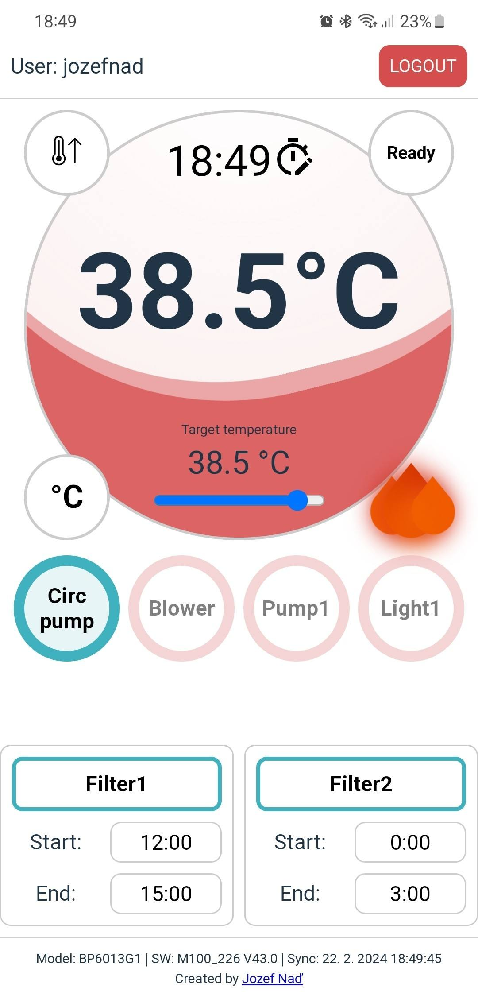

# Balboa SPA Web (cloud control of your hot tub)

This project is a progressive web application (PWA) for controlling Balboa SPA hot tubs. It works as a web, Android, and iOS app.

## Features

Users can control:

- Target temperature
- Time
- Heat mode
- Hold mode
- Ranges
- Pumps
- Blowers
- Auxs
- Lights
- Filter cycles
- etc.

## Requirements

- Users need to have a WiFi module with the old Balboa app (Spa Control) and have set up Cloud Connect.

## Built With

- Vue.js + Vite

## API

- Balboa Cloud API (bwgapi)

### Alternative backend avoiding balboa cloud

https://github.com/NorthernMan54/esp32_balboa_panel

## Recommended IDE Setup

- [VS Code](https://code.visualstudio.com/) + [Volar](https://marketplace.visualstudio.com/items?itemName=Vue.volar) (and disable Vetur) + [TypeScript Vue Plugin (Volar)](https://marketplace.visualstudio.com/items?itemName=Vue.vscode-typescript-vue-plugin).
