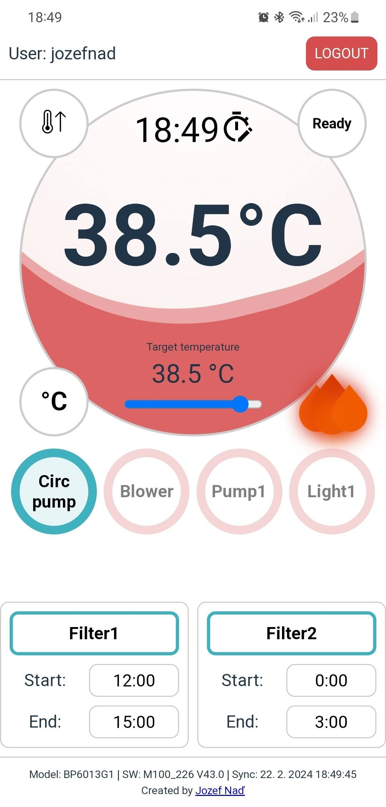

# Balboa SPA Web (cloud control of your hot tub)

> [!WARNING]
> **DEPRECATED / UNMAINTAINED**
> 
> This project is no longer functional or actively maintained. Balboa has changed their server/API access structure to a paid subscription model, breaking compatibility with this tool.
> 
> This repository remains public for archival purposes only.

This project is a progressive web application (PWA) for controlling Balboa SPA hot tubs. It works as a web, Android, and iOS app.

## Features

Users can control:

- Target temperature
- Time
- Heat mode
- Hold mode
- Ranges
- Pumps
- Blowers
- Auxs
- Lights
- Filter cycles
- etc.

## Requirements

- Users need to have a WiFi module with the old Balboa app (Spa Control) and have set up Cloud Connect.

## Built With

- Vue.js + Vite

## API

- Balboa Cloud API (bwgapi)

#### Alternative backend avoiding balboa cloud

https://github.com/NorthernMan54/esp32_balboa_panel
